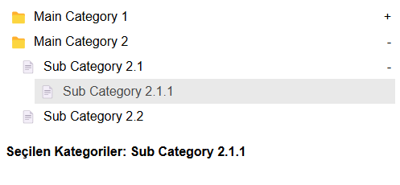

# MtTree

MtTree provides a simple collapsible tree structure for displaying nested data, making it easy to manage hierarchical information.



## Features

- **Simplicity**: Designed to be intuitive and easy to use.
- **Dynamic Creation**: Automatically generates the tree structure based on provided data.
- **Customizable**: Easily style and modify to fit your needs.

## Props

- **`category`**: The data structure representing the tree hierarchy. It should be an array of objects, each with an `id`, `name`, and `masterId` to establish relationships.

- **`selectCategory`**: Callback function that returns information about the selected category. This function receives an array of the selected category details.

### Example Category Structure

Here's an example of how to structure the `category` prop:

```javascript
[
  { id: 1, name: "Main Category 1", masterId: null },
  { id: 2, name: "Subcategory 1.1", masterId: 1 },
  { id: 3, name: "Subcategory 1.2", masterId: 1 },
  { id: 4, name: "Main Category 2", masterId: null },
  { id: 5, name: "Subcategory 2.1", masterId: 4 },
  { id: 6, name: "Subcategory 2.2", masterId: 4 },
  { id: 7, name: "Subcategory 2.3", masterId: 5 },
]
```

# Example Css
```css
.category-link {
  cursor: pointer;
  padding: 5px;
  display: flex;
  align-items: center;
}

.category-link-active {
  font-weight: bold;
  color: rgb(73, 73, 73);
  width: 100%;
  background-color: red;
}

.folder-icon::before {
  content: "📁 ";
}

.content-icon::before {
  content: "📄 ";
}

.span-icon {
  cursor: pointer;
  margin-left: auto;
}
```

# Installation
You can install MtTree via npm:
```bash
npm install MtTree
```

# Usage

```javascript
import MtTree from 'mttreeview';

const categories = [ /* your categories here */ ];
const selectCategory = (selected) => {
  console.log("Selected category:", selected);
};

return(
  <>
  <MtTree categories={categories} selectCategory={selectCategory} />
)
```
